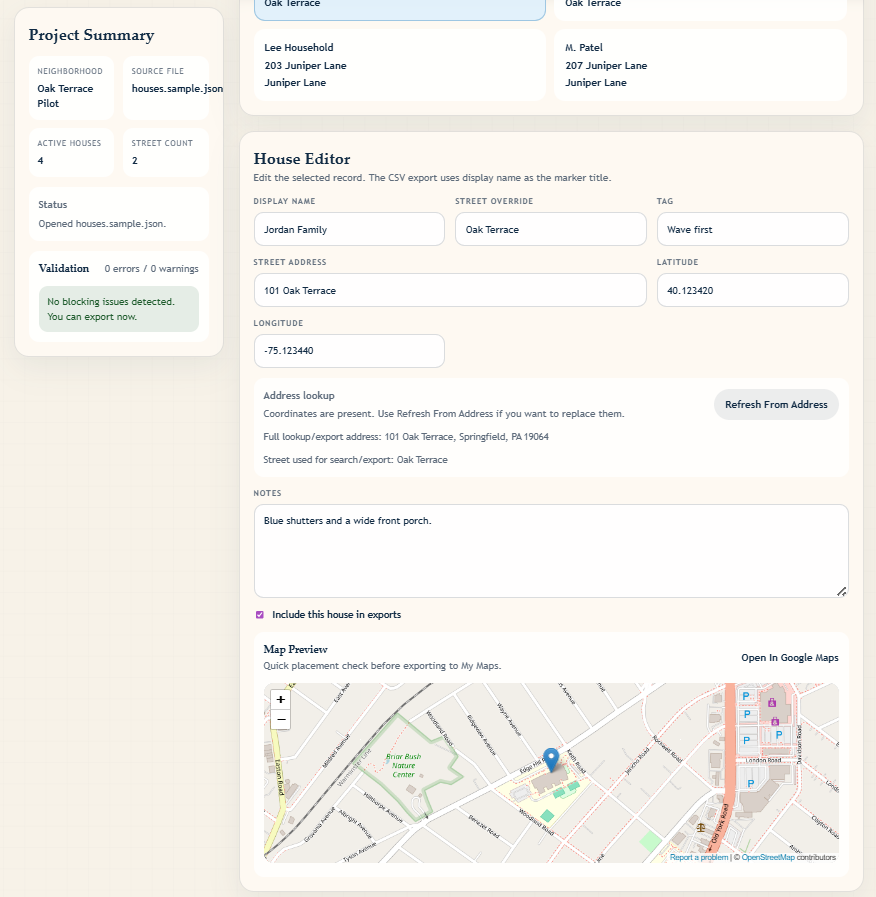

# Wander

[](LICENSE)

Wander is a local desktop web UI for maintaining a private neighborhood house list and exporting artifacts that import cleanly into Google My Maps. The idea for this app was born out of my desire to keep a track of the names of people in my neighborhood and the locations of their houses, so I can quickly look them up on Google maps and refer to them by name when I walk by with my dog. I wanted a simple way to maintain that data without sharing it with any third-party service.

> **Privacy note:** All data stays in your browser. Wander does not send your neighborhood data to any server. Geocoding requests go to the U.S. Census Bureau and OpenStreetMap Nominatim APIs using only the street address — no names or notes are transmitted.

The current app is designed around a simple single-user workflow:

1. Open a neighborhood JSON file or start from the built-in sample draft.
2. Set shared map configuration once, including town, state, and ZIP.
3. Edit house records with names, street-address lines, notes, and optional tags.
4. Auto-fill coordinates from the address or override them manually.
5. Review the selected house on a small preview map.
6. Export one combined CSV for houses and, optionally, a KML boundary.
7. Import both into Google My Maps and view the resulting custom map in Google Maps on your phone.

## Features

- Local JSON-based editing with browser draft persistence.
- File open and save-back support on Chromium browsers via the File System Access API.
- Shared locality configuration so town, state, and ZIP do not need to be repeated on every house.
- Automatic coordinate lookup for blank latitude and longitude fields.
- Census-first geocoding for structured U.S. addresses, with OpenStreetMap Nominatim fallback.
- Embedded preview map for the currently selected house.
- Combined address-first CSV export for My Maps markers.
- Optional KML export for a neighborhood boundary overlay.
- Validation for missing names, missing addresses, malformed coordinates, duplicate addresses, and suspicious duplicate coordinates.

## UI Sample



## Prerequisites

- [Node.js](https://nodejs.org/) 18 or later
- npm (included with Node.js)

## Getting started

```bash
git clone https://github.com/sujitdmello/wander.git
cd wander
npm install
npm run dev
```

Then open the URL shown in the terminal (usually `http://localhost:5173`).

## Apple Watch companion app

Wander also includes a native watchOS app for in-walk, distance-sorted house lookup on Apple Watch.

- Watch app project: [watchos](watchos/)
- Setup, build, and usage guide: [watchos/README.md](watchos/README.md)

## Scripts

| Command | Description |
|---------|-------------|
| `npm run dev` | Start the local dev server |
| `npm run build` | Type-check and build for production |
| `npm run preview` | Serve the production build locally |
| `npm run lint` | Run ESLint |

## Data model

The app expects a JSON document with a `config` section and a `houses` array.

```json
{
  "config": {
    "neighborhoodName": "Oak Terrace",
    "houseLayerName": "Oak Terrace Houses",
    "boundaryLayerName": "Oak Terrace Boundary",
    "locality": "Springfield",
    "region": "PA",
    "postalCode": "19064",
    "exportNotes": "Imported from Wander",
    "boundaryPoints": [
      { "lat": "40.1234", "lng": "-75.1234" },
      { "lat": "40.1235", "lng": "-75.1229" },
      { "lat": "40.1230", "lng": "-75.1227" }
    ]
  },
  "houses": [
    {
      "id": "house-001",
      "displayName": "Jordan Family",
      "address": "101 Oak Terrace",
      "street": "Oak Terrace",
      "latitude": "40.123456",
      "longitude": "-75.123456",
      "note": "Blue shutters, corner lot",
      "tag": "Wave first",
      "active": true
    }
  ]
}
```

### Config fields

- `neighborhoodName`: used for the UI and default export filenames.
- `houseLayerName`: display name for the main My Maps house layer.
- `boundaryLayerName`: display name for the optional boundary layer.
- `locality`: shared town or city appended to every geocoding/export address.
- `region`: shared state or province value.
- `postalCode`: shared ZIP or postal code value.
- `exportNotes`: appended to each exported house description.
- `boundaryPoints`: optional polygon vertices for KML export.

### House fields

- `displayName`: becomes the marker title in My Maps.
- `address`: the street-address line only, such as `101 Oak Terrace`.
- `street`: optional override field. If left blank, Wander derives the street name from the address.
- `latitude` and `longitude`: explicit coordinates; these take precedence once present.

## Tech stack

- [React](https://react.dev/) 19 + TypeScript
- [Vite](https://vite.dev/) 8 for dev server and bundling
- No backend — runs entirely in the browser

## Contributing

Contributions are welcome! Please open an issue to discuss your idea before submitting a pull request.

1. Fork the repository.
2. Create a feature branch (`git checkout -b my-feature`).
3. Make your changes and confirm `npm run build` and `npm run lint` pass.
4. Open a pull request against `main`.

## License

This project is licensed under the [MIT License](LICENSE).
- `latitude` and `longitude`: optional editor-side coordinates used for preview, verification, and manual correction.
- `note`: included in the exported description field.
- `tag`: optional editor-only helper field that is also exported.
- `active`: inactive houses remain in JSON but are excluded from CSV export.

## Address composition

Wander now separates the street-address line from the shared locality values.

If your map configuration contains:

- `locality`: `Springfield`
- `region`: `PA`
- `postalCode`: `19064`

and a house record contains:

- `address`: `101 Oak Terrace`

the app composes the full postal address as:

```text
101 Oak Terrace, Springfield, PA 19064
```

That composed address is:

- shown in the editor for verification,
- used for geocoding,
- exported in the CSV `Address` column,
- included in the marker description together with notes and export notes.

The `Street` column in the CSV is also filled automatically from the address when no explicit street override is present.
Latitude and longitude remain in the JSON file and editor, but they are no longer exported in the My Maps CSV because address-based placement proved more reliable.

## Geocoding behavior

Coordinate lookup is optimized for U.S. residential addresses.

1. Wander first tries the U.S. Census geocoder with structured `street`, `city`, `state`, and `ZIP` fields.
2. If Census does not return a match, Wander falls back to OpenStreetMap Nominatim using one or more composed address strings.
3. If a house already has both latitude and longitude, Wander leaves them alone until you explicitly click `Refresh From Address`.

Important constraints:

- Census geocoding usually returns address-range coordinates, not necessarily rooftop parcel points.
- Nominatim fallback is network-based and can still miss or approximate some addresses.
- For houses where the returned point is slightly off, you can manually correct latitude and longitude in the editor.

## Preview map

The selected house includes a compact embedded preview map using OpenStreetMap.

- It updates when the house coordinates change.
- It provides a quick visual check before export.
- It also includes a link to open the selected coordinates in Google Maps.

## File workflow

### Chromium browsers

On browsers such as Chrome or Edge, Wander can:

1. Open a JSON file directly.
2. Edit it in place.
3. Save changes back to the same file.

### Other browsers or fallback mode

If direct file save-back is unavailable, you can still:

1. Import a JSON file through the fallback file picker.
2. Edit the data in the app.
3. Download a fresh JSON snapshot when you want to keep the changes.

The app also keeps a browser-local draft in `localStorage` so work is not lost immediately between reloads.

## Export workflow

### Combined CSV

The house export produces one CSV file containing all active houses with these columns:

- `Name`
- `Description`
- `Address`
- `Street`
- `Tag`
- `Active`

The `Address` column is the composed full postal address using the shared locality config.
The CSV intentionally omits latitude and longitude so Google My Maps geocodes each marker from the address field during import.

### Boundary KML

If at least three valid boundary points are present, Wander can generate a simple polygon KML file for neighborhood orientation.

## Import into Google My Maps

1. Export the combined CSV from Wander.
2. Open Google My Maps on desktop and create a new map.
3. Import the CSV as the main house layer.
4. When prompted for location fields, choose the `Address` column.
5. Choose the `Name` column for the marker title.
6. Optionally import the boundary KML as a separate layer.
7. Open Google Maps on your phone and find the map under `Saved` and then `Maps`.

## Sample data

A ready-to-edit sample file is included at [data/houses.sample.json](data/houses.sample.json). It demonstrates:

- shared locality config,
- a few sample house records,
- optional boundary points,
- export-ready structure.

## Current scope

Included:

- Local single-user editing
- JSON source of truth
- Shared locality configuration
- Census-first address geocoding with fallback
- Preview map
- Combined My Maps CSV export
- Optional neighborhood boundary KML export
- Validation for common data quality issues

Not included:

- Live nearby-only reveal logic inside Google Maps
- Automated White Pages scraping
- Parcel-accurate polygons
- Multi-user collaboration or hosted storage

